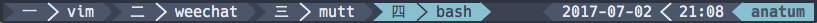

# Tmux Window Index

A tmux plugin that lets you change how windows indices are displayed.

Default tmux behavior (Arabic numbers):


With this plugin (Chinese numbers):


## Usage

Just add `#{window_index}` to your `window-status-format` and
`window-status-current-format`. For example:
```
setw -g window-status-format "#{window_index} #W "
```

The plugin can also be configured to control what indices are used.
See the *Configuration* section for more information.

## Installation with Tmux Plugin Manager (recommended)

Add plugin to the list of TPM plugins:

```tmux.conf
set -g @plugin 'tsroten/tmux-window-index'
```

Press prefix + I to install it.

## Manual Installation

Clone the repo:

```bash
$ git clone https://github.com/tsroten/tmux-window-index.git
```

Add this line to your .tmux.conf:

```
run-shell ~/path/to/window_index.tmux
```

Reload TMUX environment with:

```bash
$ tmux source-file ~/.tmux.conf
```

## Configuration

The window indices can be configured with a pipe-delimited list:

```tmux.conf
set -g @window_indices "〇|一|二|三|四|五|六|七|八|九|十|十一|十二"
```
